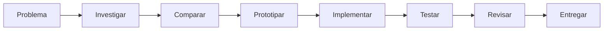

<div align="center">


<a href="https://github.com/MarcosFG-Dev">
  
</a>
<a href="mailto:marcosfg74@gmail.com">
  
</a>


<br/><br/>


</div>

---

## `> whoami`

```yaml
name: Marcos Ferreira
role: Software Engineer
focus:
  - Backend Engineering
  - Full-Stack Development
  - System Architecture
  - Security
  - Java & Minecraft Ecosystems
  - Applied AI
philosophy: "Código, arquitetura e produto — IA como ferramenta, não como atalho."
```

Sou desenvolvedor **full-stack** com foco em **backend, arquitetura de sistemas, segurança e construção de produtos digitais**.

Meu trabalho acontece no código: implemento regras de negócio, APIs, persistência, autenticação, integrações, interfaces, comandos, eventos, sistemas de configuração, testes e ferramentas de diagnóstico.

Tenho experiência prática construindo soluções com **Java, JavaScript, Node.js, React, Python, PHP, PostgreSQL, MySQL, MongoDB, Docker e GitHub Actions**, além de ecossistemas para servidores Minecraft com **Paper, Spigot e Bukkit**.

<div align="center">

```text
REQUISITO  →  ARQUITETURA  →  CÓDIGO  →  TESTES  →  DOCUMENTAÇÃO  →  ENTREGA
```

</div>

---

## `> capabilities`

<table>
<tr>
<td width="50%" valign="top">

### ⚙️ Backend & APIs

- REST APIs e contratos de resposta
- JWT, access token e refresh token
- Regras de negócio e controle de acesso
- PostgreSQL, MySQL, MongoDB e SQLite
- Logs estruturados e health checks
- OpenAPI / Swagger
- Testes de integração
- CI/CD e automação

</td>
<td width="50%" valign="top">

### ✦ Frontend & Produto

- Interfaces responsivas
- React, HTML, CSS e JavaScript
- Integração frontend ↔ APIs
- Dashboards e fluxos autenticados
- UX mobile
- Android / Kotlin / WebView
- Loading, erros e estados
- Produtos digitais completos

</td>
</tr>

<tr>
<td width="50%" valign="top">

### ☕ Java & Minecraft

- Paper / Spigot / Bukkit
- Comandos, permissões e listeners
- Schedulers e lifecycle
- YAML e MySQL
- Vault e APIs externas
- GUIs e sistemas econômicos
- ClassLoaders e hot reload
- Ferramentas de diagnóstico

</td>
<td width="50%" valign="top">

### 🛡️ Engenharia

- Debug e refatoração
- Arquitetura em camadas
- Segurança by design
- Testes automatizados
- Docker e Git
- Pull requests e branches
- GitHub Actions
- Documentação técnica

</td>
</tr>
</table>

---

<div align="center">

## `> featured_projects`


</div>

### ⚡ VeonJS

> Runtime para servidores **Paper/Spigot**, desenvolvido para carregar, testar e distribuir mini-plugins em **Java e JavaScript**.

```text
Dynamic Compilation
      ↓
Dependency Resolution
      ↓
ClassLoader Isolation
      ↓
Hot Reload / Lifecycle
      ↓
Diagnostics / Leak Detection
```

**Engenharia envolvida**

- compilação e carregamento dinâmico de código;
- hot reload com gerenciamento de lifecycle;
- classloaders e limpeza de referências;
- JavaScript com GraalJS;
- resolução de dependências Maven;
- scanner estático de risco;
- diagnóstico de erros e possíveis memory leaks;
- empacotamento `.mplugin` com proteção e licenciamento.

**Stack**


[**→ Explorar VeonJS**](https://github.com/MarcosFG-Dev/VeonJS)

---

### 🔐 AuthAPI

> API B2B de autenticação construída com arquitetura em camadas, segurança e preparação para produção.

**Implementações**

- cadastro, login, sessão e consulta de usuário;
- access tokens de curta duração;
- refresh token rotation;
- mitigação de reutilização de refresh token;
- revogação de sessões e `logout-all`;
- hash de tokens persistidos;
- brute-force protection e rate limiting;
- validação com Zod;
- logs estruturados com request ID;
- Prisma, PostgreSQL, Docker, Swagger, Jest e Supertest.

**Stack**


[**→ Explorar AuthAPI**](https://github.com/MarcosFG-Dev/AuthAPI)

---

### 💰 mEconomy

> Plugin de economia para Minecraft com interface gráfica, persistência e integração com outros plugins.

- sistema de saldo e transações;
- comandos administrativos;
- integração com Vault;
- YAML ou MySQL;
- ranking de jogadores;
- GUI interativa;
- mensagens configuráveis;
- compatibilidade com servidores legados.

**Stack**


[**→ Explorar mEconomy**](https://github.com/MarcosFG-Dev/mEconomy)

---

### 🎟️ Tixxey

> Produto digital para descoberta, divulgação e gerenciamento de experiências e eventos.

Minha atuação inclui desenvolvimento, evolução do produto, experiência de navegação, presença web, integração mobile e estratégia de catálogo.

Também desenvolvi um MVP Android com persistência de sessão, carregamento, tratamento de ausência de internet e abertura segura de links externos.

**Stack**


[**→ Visitar Tixxey**](https://tixxey.com)

---

## `> more_projects`

| Projeto | Implementação | Stack |
|---|---|---|
| [**TitaniumMVP**](https://github.com/MarcosFG-Dev/TitaniumMVP) | Backend, autenticação, dashboards e persistência | Node.js, Express, JWT, SQLite |
| [**mTickets**](https://github.com/MarcosFG-Dev/mTickets) | Sistema de tickets para servidores | Java, comandos, eventos |
| [**mDiscord**](https://github.com/MarcosFG-Dev/mDiscord) | Integração Discord ↔ Minecraft | Java, Discord, Paper |
| [**RPGPlugin**](https://github.com/MarcosFG-Dev/RPGPlugin) | Mecânicas, eventos e progressão | Java, Bukkit |
| [**Gerador de Planilhas para Word**](https://github.com/MarcosFG-Dev/Gerador-de-Planilhas-para-Word) | Automação de documentos | JavaScript |
| [**EssentialsRX**](https://github.com/MarcosFG-Dev/EssentialsRX) | Funcionalidades essenciais | Java, Spigot |

---

<div align="center">

## `> technology_stack`

### Linguagens


### Web & Backend


### Dados & Infraestrutura


</div>

---

## `> applied_ai`

Não apresento IA como substituta da programação.

Uso IA sobre uma base real de engenharia para **aumentar velocidade de análise, prototipação e revisão**, mantendo decisões técnicas, implementação, validação e responsabilidade no processo de desenvolvimento.



**Aplicações no meu fluxo**

- investigação de bugs e hipóteses;
- revisão de abordagens técnicas;
- criação inicial de testes e casos extremos;
- documentação de sistemas e APIs;
- prototipação;
- automação de tarefas repetitivas;
- análise de segurança;
- integrações com LLMs e agentes.

> Uma resposta gerada só entra no projeto depois de ser **compreendida, validada e testada tecnicamente**.

---

## `> engineering_principles`

```text
01  READABLE      → Código deve ser compreensível.
02  TESTABLE      → Confiança vem de validação.
03  SECURE        → Segurança começa na arquitetura.
04  MAINTAINABLE  → Software precisa sobreviver à mudança.
05  DOCUMENTED    → Documentação faz parte da entrega.
06  PRAGMATIC     → Complexidade precisa justificar seu custo.
```

---

<div align="center">

## `> github_analytics`


<br/><br/>


<br/>


</div>

---

<div align="center">


### Construindo software que realmente funciona.

[**GitHub**](https://github.com/MarcosFG-Dev) • [**Email**](mailto:marcosfg74@gmail.com) • Discord: `kaka_dev`

<sub>Software Engineering • Backend • Java • Architecture • Security • Applied AI</sub>

</div>
